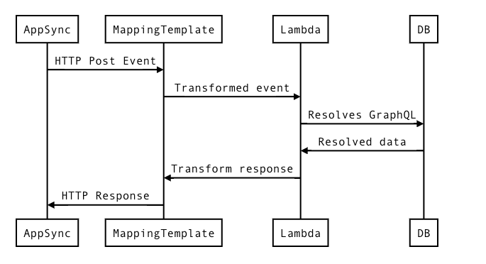

# Getting Started with App Sync Serverless

Here, I will attempt the following:

- [Scaffold an aws app](#aws-setup)
- [Test driven development](#test-driven-development)
- [Add in app-sync](#app-sync-plugin)
- [Mapping templates](#mapping-templates)

For references, all the code will live in the [sandbox-appsync](../sandbox-appsync) directory

## AWS Setup

I followed the [aws guide][r1] to setup the framework:

```zsh
cd packages
serverless create -t aws-typescript-nodejs -path sandbox-appsync
cd sandbox-appsync
```

This dumps the [contents of the nodejs template][r3] with our chosen name.

Going in and running:

```zsh
yarn
```

complets the first step of the setup process by creating the `node_modules` and `yarn.lock`

## Test Driven Development

>We'll do it live!

Although it will cost us a non-zero amount to actually deploy and test, the value this provides is nothing to scoff at. Let's deploy! As usual, I'm following the [guide on serverless][r4]

In the future, I'll need to write up a section on how to setup AWS for deployments and such, but for now, it's as simple as:

```zsh
serverless deploy -v
```

We can invoke the function with logs

```zsh
serverless invoke -f hello -l
```


Next, I setup [insomnia rest client][r5] and attempt the same thing while streaming the logs in console (to ensure everything works lol)

```zsh
serverless logs -f hello -t
```

You can install insomnia via the following on MacOS:

```zsh
brew cask install insomnia
```

Recall that my endpoint was at `https://7fmkaeuerg.execute-api.us-east-1.amazonaws.com/dev/hello`, I paste that directly into insomnia while tailing my logs.


Note that because AWS bills for usage, it's in my best interest to clean up after I'm done experimenting to not rack up charges while I'm not using

```zsh
serverless remove
```

(It's probaby a good idea to `remove` after every session)

Upon trying to remove, however, I encountered the `cloudformation:DeleteStack` error:


This is solved by going into the AWS console and adding `cloudformation:DeleteStack` permission to my user group under `iam > groups > YOUR_GROUP`

For reference, I have a permission group that looks like:

```json
{
  "Version": "2012-10-17",
  "Statement": [
    {
      "Sid": "Stmt1449904348000",
      "Effect": "Allow",
      "Action": [
        "cloudformation:CreateStack",
        "cloudformation:CreateChangeSet",
        "cloudformation:ListStacks",
        "cloudformation:UpdateStack",
        "cloudformation:DescribeChangeSet",
        "cloudformation:ExecuteChangeSet",
        "cloudformation:DescribeStacks",
        "cloudformation:DescribeStackEvents",
        "cloudformation:DescribeStackResource",
        "cloudformation:ValidateTemplate",
        "cloudformation:DeleteStack"
      ],
      "Resource": [
        "*"
      ]
    }
  ]
}
```

After adding the `"cloudformation:DeleteStack"` to my permissions, I now successfully remove

## App Sync Plugin

The idea here is to roll the [app-sync plugin][r6] into our system, following their [installation guide][r7], I first add the dependency:

```zsh
yarn add serverless-appsync-plugin
```

Then add the `serverless-appsync-plugin` into my `plugins` section in [serverless.yml](../sandbox-appsync/serverless.yml)

```yaml
plugins:
  - serverless-webpack
  - serverless-appsync-plugin
```

Next, we dump a massive `custom` section to our `serverless.yml`; it's instructively to look at the [example section][r11]

Since I have no idea what's going on, I copied over the content of the [serverless app-sync example][r13] and will now try to get it working for me (to get rid of noise, I'm currently only supporting the `meInfo` query)

>Note: be sure to have the [aws-cli][r14], and [aws-sdk][r15] installed, otherwise it seems the appsync plugin won't work


### Serverless YAML: custom.accountId

```yaml
custom:
  accountId: 1234xxxxxxxx # replace this with your accountId
```

First off, [accountId][r12] appears to be something I can get from my console; trying to deploy without it results in the following error:

```text
 Serverless Warning --------------------------------------

A valid service attribute to satisfy the declaration 'self:custom.accountId' could not be found.


Serverless Warning --------------------------------------

A valid service attribute to satisfy the declaration 'self:custom.accountId' could not be found.


Serverless Error ---------------------------------------

Trying to populate non string value into a string for variable ${self:custom.accountId}. Please make sure the value of the property is a string.
```

Apparently, `accountId` is merely a way for me to pass in my accountId details into serverless so that I can refer to it later on in `dataSources[0].config`:

```yaml
lambdaFunctionArn: "arn:aws:lambda:us-east-1:${self:custom.accountId}:function:serverless-graphql-appsync-lda-production-graphql"
serviceRoleArn: "arn:aws:iam::${self:custom.accountId}:role/Lambda-${self:custom.appSync.serviceRole}"
```

Of course, [consulting this example][r16], where they do NOT go into such details:

```yaml
config:
  lambdaFunctionArn: { Fn::GetAtt: [GraphqlLambdaFunction, Arn] }
  serviceRoleArn: { Fn::GetAtt: [AppSyncLambdaServiceRole, Arn] }
```

I have the following two questions:

Q: What is an `Arn`

A: [ARN or Amazon Resource Name][r18] apparently is a way to uniquely identify a service in amazon; typically `accountId` is a paret of an `Arn` which is why they must typically be declared

Q: What does stuff like `GraphqlLambdaFunction` and `AppSyncLambdaServiceRole` correspond to?

A: `AppSyncLambdaServiceRole` can be found later on the [config file][r17]. Based upon research it seems stuff like `{ Fn::GetAtt: [GraphqlLambdaFunction, Arn] }` is special serverless syntax for serverless to get the `ARN`s of the functions that it deploys.

>Protip: You can refer to another yaml file in `serverless.yml` via the `${file(./file-to-conf.yml)}` macro [r19]; this is particularly helpful if you don't want to commit your `accountId` or other such information into github

Next, we never have a field named `name: GraphqlLambdaFunction` anywhere, but it seems `GraphqlLambdaFunction` refers to `serverless:functions.graphql` nevertheless. It's likely that the convention at play here is to take the keys of the fields declare under `functions` and capitlize then append with `LambdaFunction` for `FN::GetAtt` to consume. [r20]

>Protip 2: using `FN::Join` can go a long way to avoid hard-coding dynamic values [r21]; see the aws guide on pseduo parameters on AWS [r22]

After doing a bunch of reasearch and making modifications to the `serverless.yml`, I am finally able to deploy via

```zsh
sls deploy -v
```

And I return with the following:

```txt
Service Information
service: sandbox-appsync
stage: dev
region: us-east-1
stack: sandbox-appsync-dev
api keys:
  None
endpoints:
  GET - https://frdkmwsy94.execute-api.us-east-1.amazonaws.com/dev/hello
functions:
  graphql: sandbox-appsync-dev-graphql
  hello: sandbox-appsync-dev-hello
layers:
  None

Stack Outputs
GraphQlApiUrl: https://2mej25sxargazhknywxcf56xf4.appsync-api.us-east-1.amazonaws.com/graphql
GraphqlLambdaFunctionQualifiedArn: arn:aws:lambda:us-east-1:768225033750:function:sandbox-appsync-dev-graphql:1
HelloLambdaFunctionQualifiedArn: arn:aws:lambda:us-east-1:768225033750:function:sandbox-appsync-dev-hello:2
ServiceEndpoint: https://frdkmwsy94.execute-api.us-east-1.amazonaws.com/dev
ServerlessDeploymentBucketName: sandbox-appsync-dev-serverlessdeploymentbucket-1pw4p7x40pqei

```

As usual, we test by following the remote logs (this time for GraphQL):

```zsh
serverless logs -f graphql -t
```

Then hitting up the generated endpoint `https://2mej25sxargazhknywxcf56xf4.appsync-api.us-east-1.amazonaws.com/graphql` via insomnia

Sending in a nascent request gets me a `403` forbidden response:

```json
{
  "errors": [
    {
      "errorType": "MissingAuthenticationTokenException",
      "message": "Missing Authentication Token"
    }
  ]
}
```

On top of that, my previous `hello` world example is now also timing out (ugh)

According to [app-sync security docs][r22], it seems it would be sensible to merely use `API_KEY` method in order to generate a key that I hard code into the system, then, make a client-side request with the following header:

```text
x-api-key: MY_API_KEY_FROM_APP_SYNC
```

To use `API_KEY` based authentication, I modify my `serverless.yml` file to:

```yml
custom:
  appSync:
    authenticationType: API_KEY
    # other stuff
```

Then redeploy with `serverless deploy -v`. I get the following output information:

```text
Service Information
service: sandbox-appsync
stage: dev
region: us-east-1
stack: sandbox-appsync-dev
api keys:
  None
endpoints:
  GET - https://jrjyf2gezf.execute-api.us-east-1.amazonaws.com/dev/hello
functions:
  graphql: sandbox-appsync-dev-graphql
  hello: sandbox-appsync-dev-hello
layers:
  None

Stack Outputs
GraphQlApiUrl: https://m7jmy6bj2jd25f2wbvz34zcz6e.appsync-api.us-east-1.amazonaws.com/graphql
GraphQlApiKeyDefault: da2-3amty6ayzjepbjfwpprkuu6s2e
GraphqlLambdaFunctionQualifiedArn: arn:aws:lambda:us-east-1:768225033750:function:sandbox-appsync-dev-graphql:2
HelloLambdaFunctionQualifiedArn: arn:aws:lambda:us-east-1:768225033750:function:sandbox-appsync-dev-hello:3
ServiceEndpoint: https://jrjyf2gezf.execute-api.us-east-1.amazonaws.com/dev
ServerlessDeploymentBucketName: sandbox-appsync-dev-serverlessdeploymentbucket-1czho7k0p3fw1
```

It appears my current `API_KEY` is `da2-3amty6ayzjepbjfwpprkuu6s2e`; I will now hard-code this into my insomnia request and try hitting the endpoint

>Note to self: if in the future that particular key or endpoint doesn't work (it probably won't), it's because I did a `serverless remove` to clean up the stack after I was done; just redeploy!

Sending in the following GraphQL request:

```graphql
query MyInfoTest {
  meInfo {
    name
    handle
    location
    description
  }
}
```

Against the following endpoint:

```text
url
https://m7jmy6bj2jd25f2wbvz34zcz6e.appsync-api.us-east-1.amazonaws.com/graphql

headers
x-api-key: da2-3amty6ayzjepbjfwpprkuu6s2e
```

I am returned with the following positive (but not perfect result):

```json
{
  "data": null,
  "errors": [
    {
      "path": [
        "meInfo"
      ],
      "data": null,
      "errorType": "Lambda:Handled",
      "errorInfo": null,
      "locations": [
        {
          "line": 2,
          "column": 3,
          "sourceName": null
        }
      ],
      "message": "Unable to find \"null\""
    }
  ]
}
```

which suggests that the `API_KEY` method of authentication works; the "Unable to find 'null'" results from incorrect setup of my mapping templates and data-input. We'll triage that in the next section

## Mapping Templates

First of all, how does the AppSync system even setup and work? Consider the following diagram for the `meInfo` request

<details>

<summary>

Structure of an AppSync request


</summary>

```sequence
participant AppSync
participant MappingTemplate
participant Lambda
participant DB

AppSync -> MappingTemplate : HTTP Post Event
MappingTemplate -> Lambda : Transformed event
Lambda -> DB : Resolves GraphQL
DB -> Lambda : Resolved data
Lambda -> MappingTemplate : Transform response
MappingTemplate -> AppSync: HTTP Response
```

</details>

The mapping templates, written in something called [VTL][r9], is responsible for transforming both the incoming request into something that lambda, dynamodb, etc., can handle, as well as the response from lambda / dynamo  / etc., into the format that the endpoint.

Putting AppSync at the boundary of this architecture allows the AWS system to handle the details of subscriptions for us; it's probably safe to think of AppSync as a sort of upgraded aws gateway layer that supports websockets

In any case, AppSync's VTL implementation seems to offer us the following:

- `$utils`
- `$context`

I will go over both in detail as I figure out what they do.

In the [context reference guide][r25], we see that `$context` consists of the following:

```json
{
   "arguments" : { /* ... */ },
   "source" : { /* ... */ },
   "result" : { /* ... */ },
   "identity" : { /* ... */ },
   "request" : { /* ... */ }
}
```

And given a GraphQL query that like:

```graphql
query {
  getPost(id: 1234) {
    postId
    title
    content
    author {
        id
        name
    }
  }
}
```

We wind up getting a `$context` that looks like:

```json
{
  "arguments" : {
    "id": "1234"
  },
  "source": {},
  "result" : {
    "postId": "1234",
    "title": "Some title",
    "content": "Some content",
    "author": {
      "id": "5678",
      "name": "Author Name"
    }
  },
  "identity" : {
    "sourceIp" : ["x.x.x.x"],
    "userArn" : "arn:aws:iam::123456789012:user/appsync",
    "accountId" : "123456789012",
    "user" : "AIDAAAAAAAAAAAAAAAAAA"
  }
}
```

Notice that `$context` contains *BOTH* the `arguments` and the `result`; this is obviously only possible in the "response" template since we couldn't possibly know what the response will be at request time. So I would expect that the request context would have a null `"result": { }`

Another important thing to note is that the `identity` field depends on the type of authentication that we've configured our app-sync in `serverless.yml`.

The possibilities are:

- API_KEY (which I am using in this example)
  - This field is *NOT* populated
- AWS_IAM
  - Populated with something that looks like:
  ```typescript
  type Identity = {
      accountId: string,
      cognitoIdentityPoolId: string,
      cognitoIdentityId: string,
      sourceIp: string[],
      username: string, // IAM user principal
      userArn: string
  }
  ```
  - In [app-sync example][r16] I copied over, the `$context.identity.username` they use in the request template thus refers to the `username` field in identity
- AMAZON_COGNITO_USER_POOLS
  - The identity field is similar to the IAM variant
  ```typescript
  type Identity = {
    sub: Uuid,
    issuer: string,
    username: string
    claims: Map<string, any>,
    sourceIp: string[],
    defaultAuthStrategy: "ALLOW" | "DENY"
  }
  ```
- OPENID
  - No idea what this will look like as they didn't have any docs

The [$utils][r26] contains utility helpers; I won't get into details here. In any case, it's probably best to not overload logic and stuff into the mapping templates (that's what the lambdas are for!)

In any case, the *reason* I was getting the previous `"message": "Unable to find \"null\""` was because I was using `API_KEY` which doesn't provide a populated `identity` field

On reflection, this makes sense, all that I've given to the system was my `API_KEY`, so app-sync has no idea what possibly `username` and stuff I might have under the `identity` field.

In any case, to work around this, I will create a `x-username` header to store the desired user name, then get it out of `$context.request.headers.x-username` field:

```vtl
{
    "version": "2017-02-28",
    "operation": "Invoke",
    "payload": {
        "field": "meInfo",
        "arguments":  $utils.toJson($context.arguments),
        "handle" : $utils.toJson($context.request.headers.x-username)
    }
}
```

The exact structure (e.g. "payload", "operation", etc.,) are as per [lambda resolver docs][r27]; in general, resolvers for different endpoints (e.g. lambda, dynamo, elasticsearch, rds, etc.,) will be different so be sure to read the references when starting out a new endpoint!

We now attempt to re-deploy via `serverless deploy`. Serverless gives me the following:

```text
Service Information
service: sandbox-appsync
stage: dev
region: us-east-1
stack: sandbox-appsync-dev
api keys:
  None
endpoints:
  GET - https://jrjyf2gezf.execute-api.us-east-1.amazonaws.com/dev/hello
functions:
  graphql: sandbox-appsync-dev-graphql
  hello: sandbox-appsync-dev-hello
layers:
  None
```

To test if this new stuff works, I fire off the previous GraphQL request with these headers:

- url: SAME_AS_BEFORE
- headers
  - x-api-key : SAME_AS_BEFORE
  - x-username : alice

And amazingly, it finally works, and I get the data I "input" into my local lambda db:

```json
{
  "data": {
    "meInfo": {
      "name": "alice",
      "handle": "@alice",
      "location": "Oustside Event Horizon",
      "description": "Short for A"
    }
  }
}
```

as the expected response. Amazing! It works!! As a bonus, the "hello world" request now also works with the new endpoint given by serverless. Awesome!

As usual, I clean up this session with `serverless remove`

# Appendix

## Appendix A - Q and A

Q: Why AppSync?

A: Because Lambda+GraphQL doesn't allow subscriptions


Q: Why VTL?

A: Presumably, the only way to auto-scale GraphQL (and do it securely) is to give the developer *extremely* underpowered tools, and a templating language (probably implemented in C or something awful like that) is the best way to do it. I'm rather a fan of this approach; only the shittiest (or most time-constained by shitty management) developer will need to constantly write everything in the lowest, most powerful, level to achieve the desired ends

# References

The reference section will log every (relevant) source I had to consult in order to get all this sh*t together. (I make a big reference list here because I'm in the habit of minimizing the number of tabs I have open). See this section in the raw format to view the entirety bibliography

[r0]: <https://stackoverflow.com/questions/11948245/markdown-to-create-pages-and-table-of-contents> "creating a table of contents in markdown"
[r1]: <https://serverless.com/framework/docs/providers/aws/guide/quick-start/> "serverless aws quick-start"
[r2]: <https://daringfireball.net/projects/markdown/syntax> "markdown syntax guide"
[r3]: <https://github.com/serverless/serverless/tree/master/lib/plugins/create/templates/aws-nodejs-typescript> "aws nodejs typescript template"
[r4]: <https://serverless.com/framework/docs/providers/aws/guide/quick-start#deploy-test-and-diagnose-your-service> "deploying a lambda"
[r5]: <https://insomnia.rest/> "Insomnia REST client"
[r6]: <https://github.com/sid88in/serverless-appsync-plugin> "Serverless AppSync Plugin"
[r7]: <https://github.com/sid88in/serverless-appsync-plugin#-installation> "AppSync Plugin Installation Guide"
[r8]: <https://hackernoon.com/running-a-scalable-reliable-graphql-endpoint-with-serverless-24c3bb5acb43> "AppSync GraphQL backend guide"
[r9]: <https://docs.aws.amazon.com/appsync/latest/devguide/resolver-mapping-template-reference-programming-guide.html> "VTL programming guide"
[r10]: <https://docs.aws.amazon.com/appsync/latest/devguide/resolver-context-reference.html> "AWS AppSync context reference"
[r11]: <https://github.com/sid88in/serverless-appsync-plugin/blob/master/example/serverless.yml#L17> "Example AppSync Serverless Custom Config"
[r12]: <https://docs.aws.amazon.com/IAM/latest/UserGuide/console_account-alias.html> "AWS Docs on Account ID"
[r13]: <https://github.com/serverless/serverless-graphql/blob/c8a2ea36923a1cd393946494c01533603705d7d5/app-backend/appsync/lambda/serverless.yml#L16> "Serverless GraphQL AppSync Lambda Backend Serverless YAML ref"
[r14]: <https://docs.aws.amazon.com/cli/latest/userguide/cli-chap-install.html> "AWS-CLI installation"
[r15]: <https://aws.amazon.com/sdk-for-node-js/> "AWS-SDK installation"
[r16]: <https://github.com/sid88in/serverless-appsync-plugin/blob/b82389a3750f62c2d2e3da8f31984d52cc5ea38a/example/serverless.yml#L101-L103> "AppSync Serverless Data Source Lambda Config Example"
[r17]: <https://github.com/sid88in/serverless-appsync-plugin/blob/b82389a3750f62c2d2e3da8f31984d52cc5ea38a/example/serverless.yml#L212> "AppSync Serverless Service Role Config Example"
[r18]: <https://docs.aws.amazon.com/general/latest/gr/aws-arns-and-namespaces.html> "ARN - amazon resource names for uniquely identifying resources on aws"
[r19]: <https://github.com/andymac4182/serverless_example/blob/e3db3dc0150f25e35e5cdfe4280563fe34efc88e/src/serverless.yml#L23> "Serverless YAML cross file references"
[r20]: <https://serverless.com/framework/docs/providers/aws/guide/resources/> "Serverless AWS Resource Guides"
[r21]: <https://botleg.com/stories/developing-in-aws-lambda-with-serverless-framework/> "Deploying AWS Lambda with Serverless and Writing the Config Files"
[r21]: <https://docs.aws.amazon.com/AWSCloudFormation/latest/UserGuide/pseudo-parameter-reference.html> "AWS Pseduo Parameter References"
[r22]: <https://docs.aws.amazon.com/appsync/latest/devguide/security.html> "AppSync permission authentication setup"
[r23]: <https://docs.aws.amazon.com/appsync/latest/devguide/resolver-mapping-template-reference-overview.html> "Resolver Mapping Template Overview"
[r24]: <https://docs.aws.amazon.com/appsync/latest/devguide/resolver-mapping-template-reference-programming-guide.html> "Resolver Map VTL Programming Guide"
[r25]: <https://docs.aws.amazon.com/appsync/latest/devguide/resolver-context-reference.html> "$context reference guide"
[r26]: <https://docs.aws.amazon.com/appsync/latest/devguide/resolver-util-reference.html> "$utils api reference guide"
[r27]: <https://docs.aws.amazon.com/appsync/latest/devguide/resolver-mapping-template-reference-lambda.html> "Lambda AppSync Resolver docs"
