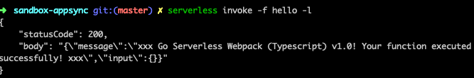
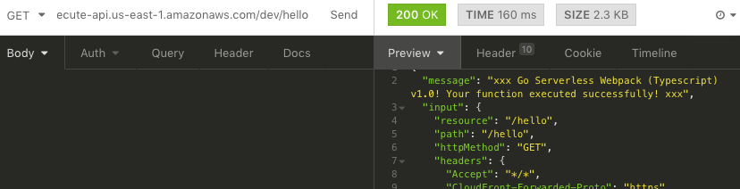
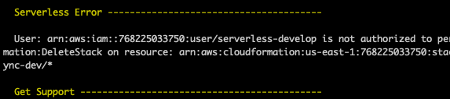

# Getting Started with App Sync Serverless

Here, I will attempt the following:

- [Scaffold an aws app](#aws-setup)
- [Test driven development](#test-driven-development)
- [Add in app-sync](#app-sync-plugin)
- [Mapping templates](#mapping-templates)
- [Deployment](#deployment)

For references, all the code will live in the [sandbox-appsync](../sandbox-appsync) directory

## AWS Setup

I followed the [aws guide][r1] to setup the framework:

```zsh
cd packages
serverless create -t aws-typescript-nodejs -path sandbox-appsync
cd sandbox-appsync
```

This dumps the [contents of the nodejs template][r3] with our chosen name.

Going in and running:

```zsh
yarn
```

complets the first step of the setup process by creating the `node_modules` and `yarn.lock`

## Test Driven Development

>We'll do it live!

Although it will cost us a non-zero amount to actually deploy and test, the value this provides is nothing to scoff at. Let's deploy! As usual, I'm following the [guide on serverless][r4]

In the future, I'll need to write up a section on how to setup AWS for deployments and such, but for now, it's as simple as:

```zsh
serverless deploy -v
```

We can invoke the function with logs

```zsh
serverless invoke -f hello -l
```



Next, I setup [insomnia rest client][r5] and attempt the same thing while streaming the logs in console (to ensure everything works lol)

```zsh
serverless logs -f hello -t
```

You can install insomnia via the following on MacOS:

```zsh
brew cask install insomnia
```

Recall that my endpoint was at `https://7fmkaeuerg.execute-api.us-east-1.amazonaws.com/dev/hello`, I paste that directly into insomnia while tailing my logs.



Note that because AWS bills for usage, it's in my best interest to clean up after I'm done experimenting to not rack up charges while I'm not using

```zsh
serverless remove
```

(It's probaby a good idea to `remove` after every session)

Upon trying to remove, however, I encountered the `cloudformation:DeleteStack` error:



This is solved by going into the AWS console and adding `cloudformation:DeleteStack` permission to my user group under `iam > groups > YOUR_GROUP`

For reference, I have a permission group that looks like:

```json
{
  "Version": "2012-10-17",
  "Statement": [
    {
      "Sid": "Stmt1449904348000",
      "Effect": "Allow",
      "Action": [
        "cloudformation:CreateStack",
        "cloudformation:CreateChangeSet",
        "cloudformation:ListStacks",
        "cloudformation:UpdateStack",
        "cloudformation:DescribeChangeSet",
        "cloudformation:ExecuteChangeSet",
        "cloudformation:DescribeStacks",
        "cloudformation:DescribeStackEvents",
        "cloudformation:DescribeStackResource",
        "cloudformation:ValidateTemplate",
        "cloudformation:DeleteStack"
      ],
      "Resource": [
        "*"
      ]
    }
  ]
}
```

After adding the `"cloudformation:DeleteStack"` to my permissions, I now successfully remove

## App Sync Plugin

The idea here is to roll the [app-sync plugin][r6] into our system

## Mapping Templates

## Deployment

# References

The reference section will log every (relevant) source I had to consult in order to get all this sh*t together. (I make a big reference list here because I'm in the habit of minimizing the number of tabs I have open)

[r0]: <https://stackoverflow.com/questions/11948245/markdown-to-create-pages-and-table-of-contents> "creating a table of contents in markdown"
[r1]: <https://serverless.com/framework/docs/providers/aws/guide/quick-start/> "serverless aws quick-start"
[r2]: <https://daringfireball.net/projects/markdown/syntax> "markdown syntax guide"
[r3]: <https://github.com/serverless/serverless/tree/master/lib/plugins/create/templates/aws-nodejs-typescript> "aws nodejs typescript template"
[r4]: <https://serverless.com/framework/docs/providers/aws/guide/quick-start#deploy-test-and-diagnose-your-service> "deploying a lambda"
[r5]: <https://insomnia.rest/> "Insomnia REST client"
[r6]: <https://github.com/sid88in/serverless-appsync-plugin> "Serverless AppSync Plugin"
